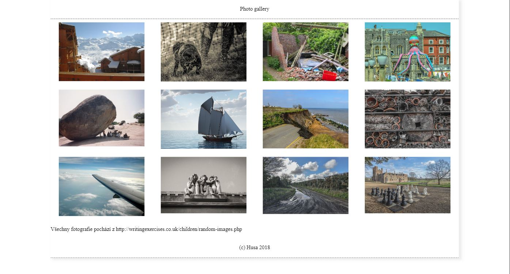
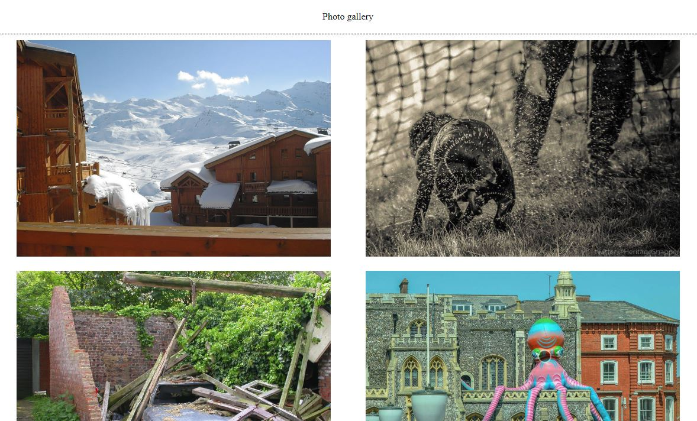
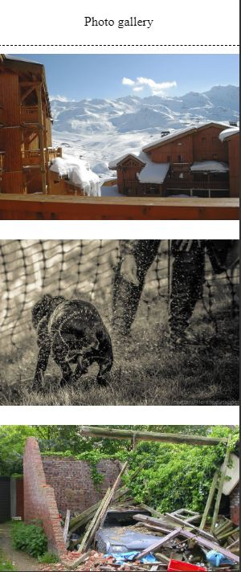

# Domácí úkol mediaqueries

## Zadání
K fotogalerii dodělat responsivní verzi, která bude mít tři break-pointy (verze). 
- počítače (nad 1300px) 
- tablety (800px - 1200px)
- mobily (do 800px)

Měnit se bude nejen šířka celého *fix-container*, ale i jednotlivých sloupců.

- počítače
  - *fix-container*: 1200px
  - počet sloupců: 4
- tablety 
  - *fix-container*: 100%
  - počet sloupců: 2
- mobily
  - *fix-container*: 100%
  - počet sloupců: 1

## Náhledy
### PC

### Tablet

### Mobil

